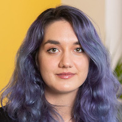
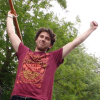
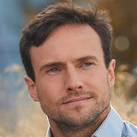
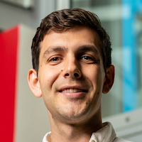
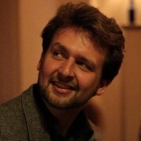

# Organisation Committee

* [Jelena Luketina](https://whirl.cs.ox.ac.uk/member/jelena-luketina/), University of Oxford

* [Nantas Nardelli](http://www.robots.ox.ac.uk/~nantas/), University of Oxford

* [Jakob Foerster](https://sites.google.com/view/jakob-foerster/home), University of Toronto / FAIR

* [Victor Zhong](https://www.victorzhong.com/), University of Washington

* [Jacob Andreas](http://web.mit.edu/jda/www/), MIT

* [Edward Grefenstette](https://www.egrefen.com/), UCL / FAIR

* [Tim Rocktäschel](https://rockt.github.io/), UCL / FAIR

For any questions or feedback, please contact us at [larel2020@googlegroups.com](mailto:larel2020@googlegroups.com)!

# Sponsors

We are very thankful to our sponsor:

