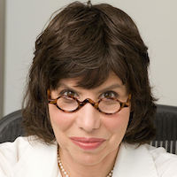
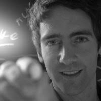
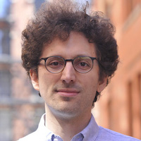
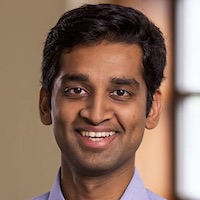
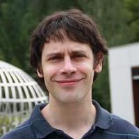

# Program

# Invited Speakers

* [Alison Gopnik](http://alisongopnik.com/), Berkeley 

* [Felix Hill](https://fh295.github.io/), DeepMind 

* [Yoav Artzi](https://yoavartzi.com/), Cornell 

* [Marc-Alexandre Côté](https://www.microsoft.com/en-us/research/people/macote/), Microsoft Research 

* [Karthik Narasimhan](https://www.cs.princeton.edu/~karthikn/), Princeton 

* [Angeliki Lazariou](http://angelikilazaridou.github.io/), DeepMind 

* [Arthur Szlam](https://scholar.google.com/citations?user=u3-FxUgAAAAJ&hl=en), FAIR 

# Schedule

TBD

